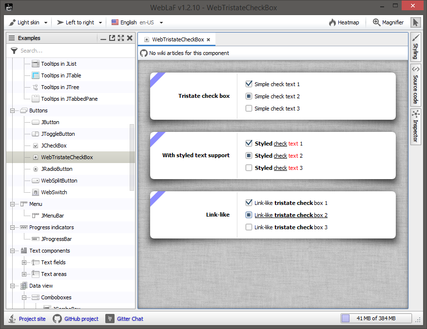

About
----------
[](https://github.com/mgarin/weblaf/releases)
[](https://github.com/mgarin/weblaf)
[](https://github.com/mgarin/weblaf/blob/master/LICENSE.txt)
[](https://github.com/mgarin/weblaf/commits/master)
[](https://gitter.im/mgarin/weblaf)

**WebLaf** is a Look and Feel and component library written in pure Java for cross-platform desktop Swing applications.

You can check out brand new demo application -

[](https://github.com/mgarin/weblaf/releases/download/v1.2.10/weblaf-demo-1.2.10-jar-with-dependencies.jar)

It is an [executable JAR](https://github.com/mgarin/weblaf/releases/download/v1.2.10/weblaf-demo-1.2.10-jar-with-dependencies.jar) which you can run if you have JRE 6 or higher installed.

**Features**

- Fully reskinnable UI with a few predefined skins available out-of-the-box
- Wide range of popular custom components and features 
- Advanced versions of all basic Swing components
- RTL orientation support for basic Swing and custom components
- Multi-language support for all UI elements
- Advanced API for providing UI element tooltips
- Advanced API for saving and restoring UI element states
- Advanced API for assigning hotkeys to UI elements and actions 
- Countless utilities for convenient work with Swing APIs
- Application plugin support
- And more...

**WebLaF project is...**

- Fully open-source without any hidden proprietary code
- Constantly growing and being improved
- Open for any suggestions and improvements


Binaries
----------

You can acquire latest WebLaF binaries from "releases" section here:<br>
https://github.com/mgarin/weblaf/releases

If you are working with a Maven project you can add WebLaF dependency like this:
```xml
<dependency>
  <groupId>com.weblookandfeel</groupId>
  <artifactId>weblaf-ui</artifactId>
  <version>1.2.10</version>
</dependency>
```
You can also use `RELEASE` or `LATEST` version instead of specific one.

Full list of modules/artifacts available in v1.2.10:

- `weblaf-core` - Module containing all basic managers, interfaces and classes
- `weblaf-ui` - Module containing all components, UIs, painters, skins, managers and anything related to them
- `weblaf-plugin` - Module containing `PluginManager` [ [wiki guide](https://github.com/mgarin/weblaf/wiki/How-to-use-PluginManager) ]
- `weblaf-ninepatch-editor` - Module containing `NinePatchEditor`
- `weblaf-demo` - Module containing `DemoApplication`

You can use any of these in your Maven project to include respective module.


Quick start
----------

First you will need to download one of the [newest releases](https://github.com/mgarin/weblaf/releases) or add a Maven dependency to your project as shown above. If you are not using Maven - don't forget to download all dependencies mentioned in release notes.

Once you have all necessary binaries attached to your project you can to install WebLaF by simply calling `WebLookAndFeel.install ()` or using one of standard Swing `UIManager` methods for installing L&F:
```java
public class QuickStart
{
    public static void main ( final String[] args )
    {
        // You should always work with UI inside Event Dispatch Thread (EDT)
        // That includes installing L&F, creating any Swing components etc.
        SwingUtilities.invokeLater ( new Runnable ()
        {
            @Override
            public void run ()
            {
                // Install WebLaF as application LaF
                WebLookAndFeel.install ();

                // You can also do that in one of the old-fashioned ways:
                // UIManager.setLookAndFeel ( new WebLookAndFeel () );
                // UIManager.setLookAndFeel ( "com.alee.laf.WebLookAndFeel" );
                // UIManager.setLookAndFeel ( WebLookAndFeel.class.getCanonicalName () );

                // Create you application here using Swing components
                // JFrame frame = ...

                // Or use similar Web* components to get access to some extended features
                // WebFrame frame = ...
            }
        } );
    }
}
```
That's it, now your application is using WebLaF.

If you are new to WebLaF or Swing in general I recommend reading these wiki articles first:
- [How to use WebLaF](https://github.com/mgarin/weblaf/wiki/How-to-use-WebLaF)
- [Event-Dispatch-Thread](https://github.com/mgarin/weblaf/wiki/Event-Dispatch-Thread)
- [Styling introduction](https://github.com/mgarin/weblaf/wiki/Styling-introduction)

You can also check [other wiki articles](https://github.com/mgarin/weblaf/wiki) - there are quite a few available for different WebLaF components and features and they might save you a lot of time.


Licensing
----------

WebLaF is available under GPLv3 license for any non-commercial open-source projects. Commercial license is available as an alternative option and intended for closed-source and/or commercial projects. It removes restrictions dictated by GPLv3 license and can either be used for a single or any amounts of projects, depending on the commercial license sub-type.

I know how much frustration license policies could cause, that is why here is a short compilation of restrictions of each available WebLaF license: 

1. **GPLv3 license [ [weblaf-gpl.txt](licenses/weblaf-gpl.txt) ]**

    - Unlimited amount of non-commercial open-source projects
    - Unlimited amount of developers working with your non-commercial open-source projects
    - Unlimited amount of end-user distributions of your non-commercial open-source projects 
    - Full access to complete library [source code](https://github.com/mgarin/weblaf)
    - Free [updates](https://github.com/mgarin/weblaf/releases) to all newer minor and major versions
    - Free support via [GitHub](https://github.com/mgarin/weblaf/issues), [Gitter](https://gitter.im/mgarin/weblaf) and [e-mail](mailto:mgarin@alee.com
    
    Limitations:
    
    - Cannot use in any commercial projects
    - Cannot create any commercial derivative projects

2. **Single-application commercial license [ [weblaf-commercial.txt](licenses/weblaf-commercial.txt) ]**

    - Single commercial closed-source project
    - Unlimited amount of developers working with your commercial project
    - Unlimited amount of end-user distributions of your commercial project
    - Full access to complete library [source code](https://github.com/mgarin/weblaf)
    - Free [updates](https://github.com/mgarin/weblaf/releases) to all newer minor and major versions
    - Prioritized support via [GitHub](https://github.com/mgarin/weblaf/issues), [Gitter](https://gitter.im/mgarin/weblaf) and [e-mail](mailto:mgarin@alee.com)
    
    Limitations:
    
    - Can only be used in one of your commercial closed-source project
    - Cannot create any commercial derivative L&F libraries

3. **Multi-application commercial license [ [weblaf-commercial.txt](licenses/weblaf-commercial.txt) ]**

    - Unlimited amount of commercial closed-source projects
    - Unlimited amount of developers working with your commercial project(s)
    - Unlimited amount of end-user distributions of your commercial project(s)
    - Full access to complete library [source code](https://github.com/mgarin/weblaf)
    - Free [updates](https://github.com/mgarin/weblaf/releases) to all newer minor and major versions
    - Prioritized support via [GitHub](https://github.com/mgarin/weblaf/issues), [Gitter](https://gitter.im/mgarin/weblaf) and [e-mail](mailto:mgarin@alee.com)
    
    Limitations:
    
    - Cannot create any commercial derivative L&F libraries
    
Commercial license can be purchased from the [WebLaF site](http://weblookandfeel.com/buy/). You can also contact me directly [through e-mail](mailto:mgarin@alee.com) for other payment options.


Feedback
----------

If have any questions, found some bugs or want to propose some improvements, you can:

- **[Open an issue](https://github.com/mgarin/weblaf/issues) here on GitHub**<br>
  I highly recommend this option for any bugs or feature requests

- **Chat with me and other WebLaF users [on Gitter](https://gitter.im/mgarin/weblaf)**<br>
  This option is best for any questions you want to ask and receive answer as fast as possible

- **Contact me directly at [mgarin@alee.com](mailto:mgarin@alee.com)**<br>
  This might be convenient if you want to discuss some issue or ask questions privately 